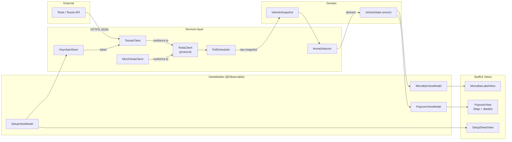
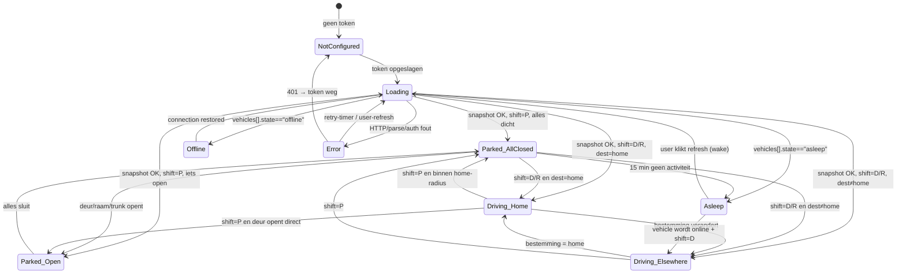

# Tesla Menubar App — Plan

Een macOS menubar-app die compact de status van mijn Tesla toont (ETA bij rijden, openstaande deuren/ramen bij stilstand) en bij klikken een kaartje met route, batterij en sync-info opent.

Dit document is **alleen een plan** — er wordt nog niets geïmplementeerd.

---

## 1. Beslissingen in het kort

### 1.1 Data-bron: **Tessie API** (primair), met optie om later naar Fleet API te migreren

| Optie | Voor | Tegen | Kosten | Wake-impact |
|---|---|---|---|---|
| **Tesla Fleet API** (officieel) | Officieel ondersteund, vereist voor nieuwe partner-integraties sinds 2024; goed gedocumenteerd; streaming endpoint beschikbaar | Verplichte developer-registratie + app-approval + eigen OAuth-redirect host (niet triviaal voor één persoonlijke app); virtual-key pairing flow nodig voor commando's; pre-2021 Model S/X krijgen beperkte data | Gratis tier (1.000 calls/dag) ruim voldoende, daarna pay-as-you-go | Goed: aparte "wake" endpoint, calls naar slapende auto retourneren `408` i.p.v. te wekken |
| **Tessie** | Slimme polling met "no-wake" garantie ingebouwd; één Bearer-token, geen OAuth-dans; rijke history; werkt direct op alle modellen | Betaald (~€5/maand); third-party afhankelijkheid; gebruikt onder de motorkap nog steeds Owner/Fleet API | ~€5/mnd na 14-dagen trial | Best-in-class: Tessie houdt zelf bij wanneer de auto slaapt en voorkomt onnodig wekken |
| **TeslaFi** | Historie/logging-georiënteerd; gratis trial | Polling-model voelt verouderd, UI/API minder modern; minder geschikt voor real-time menubar | ~€5/mnd | Redelijk, maar minder fijn afgesteld dan Tessie |
| **`owner-api.teslamotors.com`** | "Just works" met email/wachtwoord-token in legacy projecten | **Deprecated**; Tesla heeft aangekondigd hem af te knijpen; geen captcha/MFA support; risico op account-lockout | Gratis | Slecht: naïeve polling wekt de auto |
| **Teslemetry** | Vergelijkbaar met Tessie, streaming-first, gebruikt officiële Fleet Telemetry | Nieuwer/minder bewezen; pricing per voertuig | ~€5/mnd | Goed (push i.p.v. poll) |

**Aanbeveling:** start met **Tessie**. De flow van een persoonlijke macOS-app is dan: gebruiker plakt eenmalig een Tessie access token in een setup-sheet, we slaan 'm op in Keychain, klaar. Geen eigen OAuth-server, geen Tesla developer-registratie, en de wake-bescherming is ingebouwd. We isoleren de data-laag achter een `TeslaClient`-protocol zodat een latere migratie naar Fleet API of Teslemetry zonder rework op de UI kan.

### 1.2 "Naar huis vs. elders"-detectie

Een gelaagde aanpak:

1. **Primaire bron — `active_route_destination` / nav-state uit `vehicle_data` (`drive_state`)**. Tessie en Fleet API geven, mits nav actief is, de bestemmingscoördinaten + `active_route_minutes_to_arrival` + `active_route_energy_at_arrival` terug. Als die velden gevuld zijn, gebruiken we ze direct.
2. **Fallback — geofence rond "thuis"**. Gebruiker pint éénmaal in setup een thuislocatie op een MapKit-kaart (of "use current location"). Wanneer er geen actieve nav is maar de auto rijdt (`shift_state` in {D, R}) **en** koersrichting + dalende afstand naar thuis ⇒ classificeer als "rijdt naar huis", schat ETA via `haversine(distance) / speed` met een veiligheidsmarge.
3. **Edge case — thuis aankomen zonder nav.** Zodra de auto binnen ~150m van thuis en `shift_state == P` voor ≥30s ⇒ "geparkeerd thuis". Geen ETA meer tonen.
4. **Edge case — onbekende bestemming, niet richting thuis.** Toon ETA als "—" en val terug op afstand + heading; popover toont alleen huidige positie.

### 1.3 Polling-strategie

| Auto-state | Interval (foreground) | Interval (background) | Endpoint | Wake? |
|---|---|---|---|---|
| **Rijdend** (`shift_state` ∈ {D,R,N}) | 15s | 30s | `vehicle_state` + `drive_state` | n.v.t. (auto is wakker) |
| **Geparkeerd, recent wakker** (<10 min geleden) | 60s | 2 min | full `vehicle_data` | nee |
| **Geparkeerd, slapend** | 5 min "is-online check" | 15 min | `vehicles` (lijst, geen wake) | nee |
| **Charging** | 60s | 5 min | `charge_state` | nee |
| **Offline / asleep**, gebruiker klikt popover | éénmalige force-refresh **met expliciete bevestiging** | — | `wake_up` + poll | **ja, alleen op user intent** |

Aanvullend:
- **Macbook op batterij of in clamshell zonder externe display** ⇒ verdubbel alle intervallen, gebruik `NSProcessInfo.thermalState` en `IOPowerSources` om te detecteren.
- **Macbook slaapt** ⇒ geen polling (`NSWorkspace.willSleepNotification` / `didWakeNotification`).
- **Streaming**: zodra we op Fleet API of Teslemetry zitten, schakel de "rijdend"-poll uit en consumeer de stream. Met Tessie polling laten we staan tot we ze migreren.
- Implementeer een **token bucket** (bv. 60 calls/uur als hard plafond) zodat een bug nooit de auto leegtrekt of credits opvreet.

### 1.4 Tech stack: **Swift + SwiftUI, `MenuBarExtra` (style: `.window`), macOS 14+**

- `MenuBarExtra(... ) { ... } label: { ... }` met `.menuBarExtraStyle(.window)` geeft precies wat we willen: een custom-rendered label én een popover-achtige window. Geen `NSStatusItem`-gepruts nodig.
- macOS 14 (Sonoma) als minimum: `MenuBarExtra` is sinds macOS 13, maar 14 brengt belangrijke fixes voor `.window`-style sizing en `Observable` macro. Voor een hobby-app is "huidige − 1" prima.
- **MapKit via SwiftUI `Map`**. Sinds iOS 17 / macOS 14 is de nieuwe `Map(initialPosition:)` API beschikbaar met `MapPolyline`, `Marker`, `Annotation`. We hebben geen `NSViewRepresentable`-wrapper nodig.
- AppKit blijft beschikbaar voor randzaken (Launch at Login via `SMAppService`, sleep-notificaties via `NSWorkspace`).

### 1.5 Configuratie & secrets

- **Keychain** (`kSecClassGenericPassword`, service `com.example.tesla-viewer`, accessgroup leeg, accessibility `kSecAttrAccessibleAfterFirstUnlock`):
  - `tessie_access_token`
  - `home_latitude`, `home_longitude`, `home_radius_m` (deze laatste eigenlijk in `UserDefaults`, maar lat/lon ook in Keychain om locatie-privacy hoog te houden)
- **Eerste-keer setup**: een SwiftUI `Sheet` die opent als er geen token in Keychain staat:
  1. Korte intro + link naar `tessie.com/settings/api`.
  2. `SecureField` voor de token, "Test connection" knop die `GET /vehicles` doet.
  3. Lijst van voertuigen, klik om te selecteren (we slaan `vehicle_id` op in `UserDefaults`).
  4. Kaart-stap: tik thuis aan, default radius 100m.
- **Geen aparte CLI helper nodig** voor Tessie. Mocht er ooit een Fleet API-migratie komen, dan voegen we een `ASWebAuthenticationSession` toe (en dat blijft binnen de app, nog steeds geen CLI).
- Token-rotatie: Tessie-tokens vervallen niet automatisch; we tonen een fout-state in de menubar en heropenen de setup-sheet bij `401`.

### 1.6 Project-structuur

```
TeslaViewer/
├── App/
│   ├── TeslaViewerApp.swift           // @main, MenuBarExtra
│   └── AppEnvironment.swift           // DI container
├── Features/
│   ├── MenuBar/
│   │   ├── MenuBarLabelView.swift     // het tekstje/icoon in de bar
│   │   └── MenuBarViewModel.swift
│   ├── Popover/
│   │   ├── PopoverView.swift
│   │   ├── PopoverViewModel.swift
│   │   ├── MapCardView.swift
│   │   └── OpenItemsListView.swift
│   ├── Setup/
│   │   ├── SetupSheetView.swift
│   │   └── SetupViewModel.swift
│   └── Settings/
│       └── SettingsView.swift
├── Domain/
│   ├── VehicleSnapshot.swift          // pure model
│   ├── VehicleState.swift             // enum: driving(.home/.elsewhere) / parked(.allClosed/.somethingOpen([Opening])) / asleep / offline / error
│   └── HomeLocation.swift
├── Services/
│   ├── TeslaClient.swift              // protocol
│   ├── TessieClient.swift             // concrete impl
│   ├── MockTeslaClient.swift          // for previews/tests
│   ├── KeychainStore.swift
│   ├── PollScheduler.swift            // adaptive polling
│   └── HomeDetector.swift             // geofence + nav-state combinator
├── Resources/
│   └── Assets.xcassets
└── Tests/
    ├── HomeDetectorTests.swift
    ├── PollSchedulerTests.swift
    └── VehicleStateMachineTests.swift
```

- **Architectuur**: MVVM met een dunne `@Observable`-laag. ViewModels nemen `TeslaClient` (protocol) en `Clock` (protocol) als dependencies → previews en tests gebruiken `MockTeslaClient` met scriptable scenarios.
- **Eén app-target** + **één test-target**. Geen aparte framework-modules; voor een single-developer macOS-app is dat overengineering tot we ≥3.000 LOC zijn.

---

## 2. Architectuurdiagram



---

## 3. State machine voor de menubar-weergave



**Weergave per state:**

| State | Menubar | Popover |
|---|---|---|
| `NotConfigured` | klein "?"-icoon | direct Setup-sheet |
| `Loading` | spinner-glyph | spinner |
| `Driving_Home` | `14 min` (puur de tekst) | kaart met route → thuis, ETA + km + SoC + SoC@arrival |
| `Driving_Elsewhere` | `28 min` | kaart met route → bestemming, idem |
| `Parked_AllClosed` | auto-icoon (SF Symbol `car.fill`) | kaart met locatie + "alles dicht" |
| `Parked_Open` | auto-icoon + oranje dot + `2` | kaart + lijst openstaande items |
| `Asleep` | grijs maan-icoon (`moon.zzz`) | "slaapt — refresh om te wekken" |
| `Offline` | grijs streep-icoon (`wifi.slash`) | laatst bekende status + sync-tijd |
| `Error` | rood uitroep-icoon, subtiel | foutmelding + retry-knop |

---

## 4. Roadmap

### Fase 1 — Skeleton + mock (≈1 weekend)
- Xcode-project, SwiftUI, macOS 14+, één app-target.
- `MenuBarExtra` met `.window`-style.
- `TeslaClient` protocol + `MockTeslaClient` met 6 scriptable scenarios (alle states uit §3).
- `MenuBarLabelView` rendert alle states statisch.
- Een dev-only "scenario picker" submenu om handmatig tussen states te switchen voor screenshots/QA.
- **Done = ik kan in de simulator door alle states scrollen zonder netwerk.**

### Fase 2 — Echte data + persistence (≈1 week avonden)
- `TessieClient` implementatie (URLSession, async/await, decodable models).
- `KeychainStore`.
- `SetupSheetView` (token + voertuigselectie + thuislocatie).
- `PollScheduler` met adaptieve intervallen (§1.3).
- `HomeDetector` (nav-data primair, geofence fallback).
- Token-bucket rate-limiter.
- **Done = de app toont mijn eigen auto correct in alle situaties die zich in een week voordoen.**

### Fase 3 — Popover met MapKit (≈1 weekend)
- `MapCardView` met `Map` + `MapPolyline` + `Marker` voor auto en bestemming.
- Routing: voor "rijdend" met active route gebruiken we de polyline uit Tessie indien beschikbaar; anders `MKDirections` request met cache (max 1x per 60s).
- `PopoverView`-layout: kaart bovenin, details onderin, footer met sync-tijd + refresh-knop.
- `OpenItemsListView` voor de parked-with-open-items state.
- **Done = klikken op de menubar geeft het kaartje dat in de eisen staat.**

### Fase 4 — Polish
- Animaties bij state-transities (cross-fade van label-content).
- Dark mode tuning (vooral kaart-tints + de open-indicator dot).
- "Open at login" via `SMAppService.mainApp.register()`.
- App-icoon (SF Symbol vector op transparant).
- Settings-pane: polling-aggressiviteit, eenheden (min/km vs ETA-tijdstip), home-locatie editor.
- Crash-/error-logging naar lokaal bestand (opt-in).
- Accessibility labels en VoiceOver-pass.
- Notarization + DMG voor distributie naar mezelf op andere Macs.

---

## 5. Open vragen

Geen blockers voor het schrijven van dit plan, maar de volgende keuzes wil ik graag bevestigen vóór Fase 1 begint:

1. **Tessie OK als startpunt, of toch direct Fleet API?** Tessie kost ~€5/mnd en is verreweg de snelste route naar een werkende app. Fleet API is gratis maar vraagt developer-registratie, een publieke redirect-URL en virtual-key-pairing — fors meer setup. Mijn voorstel: Tessie nu, Fleet API later eventueel als kosten-/onafhankelijkheidsoptimalisatie.
2. **Welk Tesla-model en bouwjaar?** Pre-2021 Model S/X missen sommige `vehicle_data`-velden (o.a. `active_route_*`); dat verandert wat we als fallback nodig hebben.
3. **Welke regio (EU/US) en taal voor de UI?** Beïnvloedt eenheden (km vs mi), tijdformaat, en — bij eventuele latere Fleet-migratie — welke regionale endpoint we moeten gebruiken.
4. **Minimum macOS-versie écht 14, of moet 13 ook werken?** Mijn voorstel is 14 vanwege de nieuwere `Map`-API en stabielere `MenuBarExtra(.window)`; alleen relevant als jij of huisgenoten nog op Ventura zitten.
5. **Mag de app de auto **wekken** bij een handmatige refresh in `Asleep`?** Default in dit plan: ja, mits expliciete user-klik. Bevestigen of dat ok is.
6. **"Open at login" standaard aan of uit?** Voor een menubar-app meestal aan, maar smaakkwestie.
7. **Privacy: telemetrie/crash-logging extern, of strikt lokaal?** Default in dit plan: strikt lokaal.

Bij akkoord op (1), (2) en (4) kan Fase 1 los.
