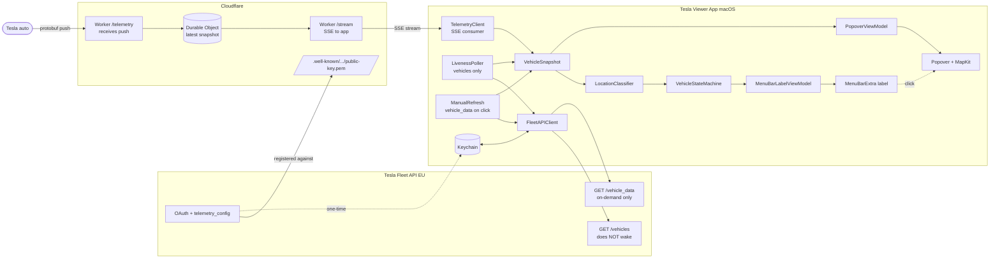
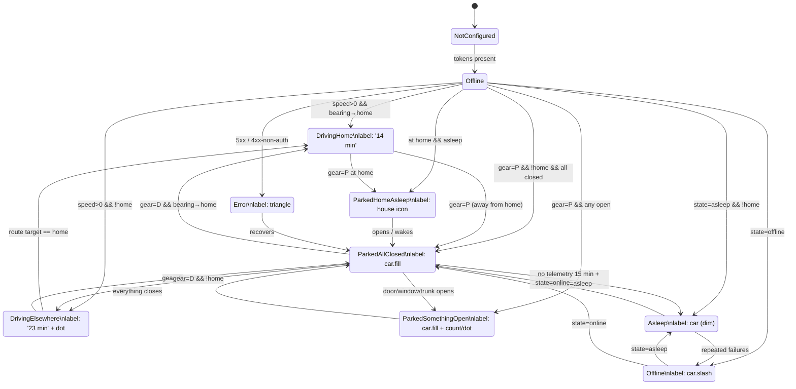

# Plan: Tesla Menubar App (macOS)

## Context

Greenfield hobby-project (repo `tesla-viewer`, branch `claude/plan-tesla-menubar-app-b9SlU`,
alleen een README aanwezig). Doel: een macOS menubar-app die op één Mac, voor één
gebruiker (EU, recent Tesla Model 3/Y/S/X), laat zien wat de auto doet — primair
de ETA tot huis of een andere bestemming, en bij stilstand of er deuren/ramen/
kofferbak/frunk openstaan. Klik op het menubar-item opent een popover met
MapKit-kaart, route, batterij en sync-info.

Randvoorwaarden uit het overleg:
- Mag niets kosten (dus geen Tessie/TeslaFi).
- Persoonlijk gebruik, geen notarization nodig, OAuth-callback mag localhost/custom-scheme zijn.
- Auto mag niet onnodig gewekt worden door polling.
- **Geen periodieke `vehicle_data`-calls**: Tesla's Fleet API rekent per call boven een kleine free tier; bij `BILLING_LIMIT=0` zou periodiek pollen API-access laten *suspenden*. Daarom Fleet Telemetry (push van auto) i.p.v. polling.

## Bevestigde keuzes

| Beslissing | Keuze |
|---|---|
| Data-bron | **Tesla Fleet API + Fleet Telemetry** (EU host, OAuth, partner-app registratie). |
| Data-flow | **Auto pusht telemetry → Cloudflare Worker → Mac-app via SSE.** Geen periodieke `vehicle_data`-calls. |
| Bestemmings-detectie | Primair telemetry `RouteActive*`-velden; fallback heading+afstand t.o.v. home. |
| "Thuis gearriveerd" | `Gear == "P"` binnen home-radius. |
| On-demand refresh | Klik op refresh in popover → één `vehicle_data`-call (handmatig, geteld). |
| Liveness-check | `GET /vehicles` (gratis, geen wake) elke 5 min als telemetry stilvalt — om online/asleep/offline te onderscheiden. |
| Tech stack app | **SwiftUI `MenuBarExtra(.window)`**, macOS 14+, SwiftUI `Map` voor popover. |
| Tech stack server | **Cloudflare Worker + Durable Object** (free tier, ruim genoeg). |
| Secrets app | Keychain (`kSecAttrAccessibleAfterFirstUnlock`), OAuth via `ASWebAuthenticationSession`. |
| Architectuur | MVVM, single target, `TeslaClient` protocol + Mock voor previews/tests. |
| Public-key hosting | **Cloudflare Pages/Worker** (free tier, werkt met private repos). |
| "Open" telt | Deuren + ramen + trunk + frunk. Charge port = aparte subtiele indicator bij laden. |
| ETA > 1 h format | `74 min` (geen `1 h 14`). |
| Thuis-geparkeerd + slapend | Klein huis-icoontje toegestaan in deze state. |
| Home-locatie | Knop "Use current location as home" in Settings, persisted in `UserDefaults`. |

## Architectuurdiagram



## State machine



Mapping naar UI:

| State | Menubar label | Popover hoofdinhoud |
|---|---|---|
| DrivingHome | `14 min` (plain text) | Map route → home; ETA / km / SOC / SOC@arrival |
| DrivingElsewhere | `23 min` + 2 px dot | Map route → dest; dest-naam; idem |
| ParkedAllClosed | `car.fill` | Map pin; SOC; "Geparkeerd sinds …" |
| ParkedSomethingOpen | `car.fill` + telling of oranje dot | Map + lijst open onderdelen (SF Symbols) |
| ParkedHomeAsleep | `house.fill` (klein) | Map pin op home + SOC + "Slapend" |
| Asleep | `car` (dimmed) | "Slapend"; laatste snapshot; refresh |
| Offline | `car.slash` | "Offline"; laatste snapshot |
| Error | `exclamationmark.triangle` | Foutmelding + retry |
| NotConfigured | `gear` | OAuth-knop |

## Data-flow tabel (i.p.v. polling)

| Bron | Wanneer actief | Hoe vaak | Tesla-quotum verbruik |
|---|---|---|---|
| Fleet Telemetry push | Auto wakker / rijdend | Auto bepaalt (config: 1–10 s rijden, 60 s parked) | **Geen** — push is gratis aan Tesla-kant |
| SSE van Worker → app | Altijd als app draait + netwerk | Push-driven, geen interval | n/a (intern) |
| `GET /vehicles` (liveness) | Alleen als telemetry > 5 min stil + app actief | 5 min op netstroom, 10 min op batterij | Heel laag, telt niet als wake |
| `GET /vehicle_data` | Alleen op klik refresh in popover | 0×/dag normaal | 1 call per klik |
| Display sleep / clamshell | — | Worker draait door, app pauzeert SSE | n/a |
| Geen netwerk | — | Reconnect met backoff bij `NWPathMonitor` satisfied | n/a |

App-observers: `NSWorkspace.willSleepNotification` / `didWakeNotification`,
`NWPathMonitor`, `ProcessInfo.processInfo.isLowPowerModeEnabled`.

## Project-structuur (te creëren in Fase 1/2)

```
TeslaViewer.xcodeproj
TeslaViewer/
  App/
    TeslaViewerApp.swift          # @main, MenuBarExtra
  Features/
    MenuBar/
      MenuBarLabelView.swift
      MenuBarLabelViewModel.swift
    Popover/
      PopoverView.swift
      PopoverViewModel.swift
      MapCardView.swift
      OpenItemsListView.swift
    Setup/
      OAuthSheet.swift
      SetupViewModel.swift          # OAuth + telemetry config push
    Settings/
      SettingsView.swift            # home, reset OAuth, Worker URL+secret
  Domain/
    Models/
      Vehicle.swift
      DriveState.swift
      ClimateState.swift
      VehicleSnapshot.swift
      MenuBarState.swift            # enum met associated values
    Services/
      TeslaClient.swift             # protocol (vehicles + vehicle_data + telemetry_config)
      FleetAPIClient.swift          # live impl, EU base URL
      MockTeslaClient.swift         # scriptbare scenario's
      TelemetryClient.swift         # SSE consumer van Worker
      LivenessPoller.swift          # vehicles-only fallback poller
      TokenStore.swift              # Keychain wrapper
      VehicleStateMachine.swift     # snapshot → MenuBarState
      LocationClassifier.swift      # home vs elsewhere, bearing
      DirectionsService.swift       # MKDirections wrapper + cache
  Infra/
    Keychain.swift
    Logger.swift
    Defaults.swift                  # @AppStorage keys
  Resources/
    Assets.xcassets                 # app-icon; menubar uses SF Symbols
TeslaViewerTests/
  VehicleStateMachineTests.swift
  LocationClassifierTests.swift
  TelemetryDecodingTests.swift

cloudflare/
  worker/
    src/
      index.ts                      # router: /telemetry, /stream, /healthz
      telemetry.ts                  # protobuf decode, push naar DO
      stream.ts                     # SSE endpoint voor app, auth via shared secret
      durable_object.ts             # VehicleStateDO: latest snapshot per VIN
      tesla_telemetry.proto         # Tesla's protobuf schema (vendored)
    wrangler.toml
    package.json
  pages/
    public/.well-known/appspecific/com.tesla.3p.public-key.pem
```

## Gefaseerde roadmap

### Fase 1 — Skeleton + mock (1–2 avonden)
- Xcode-project, macOS 14 deployment target, SwiftUI life-cycle, `MenuBarExtra(.window)`.
- Domain-modellen + `MenuBarState` enum (alle 9 cases incl. `ParkedHomeAsleep`).
- `TeslaClient` protocol + `MockTeslaClient` met scriptbare scenario's.
- `VehicleStateMachine.reduce(snapshot, home) -> MenuBarState` + unit tests.
- `MenuBarLabelView` rendert elke state correct; debug-picker om handmatig te switchen.
- Snapshot-previews per state.

**Klaar wanneer**: alle 9 menubar-states pixel-perfect renderen vanuit `MockTeslaClient`.

### Fase 2A — Cloudflare Worker (1–2 avonden)
- Cloudflare account; Worker + Durable Object via `wrangler`.
- Endpoint `POST /telemetry`: ontvangt Tesla's protobuf, decodeert (vendored schema), upsert in DO.
- Endpoint `GET /stream`: SSE, auth via `Authorization: Bearer <shared-secret>`. Stream initial snapshot + updates uit DO.
- Endpoint `GET /healthz`.
- Cloudflare Pages of dezelfde Worker host `.well-known/appspecific/com.tesla.3p.public-key.pem`.
- Custom domein (`tesla.<jouwdomein>` of `<naam>.workers.dev` — let op: Tesla eist mogelijk eigen domein voor partner-app registratie).

**Klaar wanneer**: lokaal kun je een protobuf-frame curl'en naar `/telemetry` en het komt via SSE op `/stream` binnen.

### Fase 2B — Tesla-integratie + telemetry-config (2–3 avonden)
- Tesla partner-app registreren via developer.tesla.com (EU region), public key hosten via Cloudflare.
- `Keychain.swift` + `TokenStore` (refresh + access + expiry + Worker shared secret).
- `OAuthSheet` met `ASWebAuthenticationSession`, custom scheme `teslaviewer://oauth/callback`.
- `FleetAPIClient`: `GET /vehicles`, `GET /vehicle_data`, `POST .../fleet_telemetry_config_create`, token-refresh-on-401, retry/backoff.
- `SetupViewModel`: na OAuth, push telemetry-config naar de auto met:
  - server URL = Cloudflare Worker `/telemetry`
  - velden: `Location, Speed, Gear, BatteryLevel, ChargeState, RouteActive, RouteLatitude, RouteLongitude, RouteDestination, RouteMinutesToArrival, RouteEnergyAtArrival, DoorState, WindowState, TrunkOpen, FrunkOpen`
  - intervallen: 5 s rijden, 60 s parked-online
- `TelemetryClient`: SSE-consumer met `URLSessionDataDelegate`, parse events → `VehicleSnapshot`, auto-reconnect.
- `LivenessPoller`: roept `GET /vehicles` alleen als telemetry > 5 min stil is.
- `LocationClassifier`: home-coördinaat in `Defaults`; bearing-naar-home; "Set current location as home"-knop in `SettingsView`.

**Klaar wanneer**: menubar toont live-data tijdens een rit, zonder `vehicle_data`-calls behalve handmatige refresh; offline/asleep/online overgangen kloppen.

### Fase 3 — Popover met MapKit (1–2 avonden)
- `PopoverView` (ca. 300×360): header met state-label, kaart, footer met sync + refresh.
- `MapCardView`: SwiftUI `Map` (macOS 14 API) met auto-annotation + dest-annotation + `MapPolyline`.
- `DirectionsService` met `MKDirections`, 60 s cache, fallback: rechte lijn als request faalt.
- ETA / afstand / SOC / SOC@arrival uit telemetry-velden, anders berekend.
- Parked-variant: `OpenItemsListView` met SF Symbols per open onderdeel.
- Refresh-knop triggert één `vehicle_data`-call (zichtbare spinner, want quota-relevant).

**Klaar wanneer**: popover toont kaart + route bij rijden en open-onderdelen-lijst bij stilstand.

### Fase 4 — Polish (1 avond)
- `withAnimation` op state-transities, `contentTransition(.numericText())` voor ETA.
- Dark-mode review (system colors al; map style afstemmen).
- "Open at Login" via `SMAppService.mainApp.register()`.
- `SettingsView`: home-locatie, Worker URL+secret resetten, "Reset OAuth", versie-info, "Re-push telemetry config".
- App-icoon + bevestigen dat menubar-symbols `template`-mode gebruiken.

## Te raken / aan te maken bestanden (overzicht)

Alles nieuw — geen bestaande code om aan te passen. Kritisch:
- `TeslaViewer/App/TeslaViewerApp.swift` — entry point + `MenuBarExtra`.
- `TeslaViewer/Domain/Services/FleetAPIClient.swift` — Fleet API specifics geconcentreerd.
- `TeslaViewer/Domain/Services/TelemetryClient.swift` — SSE-stream van de Worker.
- `TeslaViewer/Domain/Services/VehicleStateMachine.swift` — single source of truth voor label-keuze.
- `TeslaViewer/Features/Setup/SetupViewModel.swift` — OAuth + telemetry-config push.
- `cloudflare/worker/src/index.ts` — telemetry receiver + SSE.
- `cloudflare/worker/src/durable_object.ts` — `VehicleStateDO`.
- `cloudflare/pages/public/.well-known/appspecific/com.tesla.3p.public-key.pem` — public key host.

## Verificatie

1. **Fase 1**: `xcodebuild -scheme TeslaViewer test` → unit tests voor `VehicleStateMachine` en `LocationClassifier` slagen. Run app; debug-picker → elke menubar-state visueel checken.
2. **Fase 2A**: `wrangler dev`, dan `curl -X POST <url>/telemetry --data-binary @fixture.bin` → SSE op `/stream` ontvangt event binnen 1 s. Deploy naar productie, `curl https://.../healthz` → 200.
3. **Fase 2B**:
   - OAuth: app starten zonder tokens → sheet opent → na Tesla-login token in Keychain (`security find-generic-password -s nl.<jou>.teslaviewer`).
   - Telemetry-config: na Setup, `curl` Tesla's GET telemetry-config endpoint → response toont onze Worker URL.
   - Wake-safety: zet auto handmatig in slaapstand, monitor `log stream --predicate 'subsystem == "nl.<jou>.teslaviewer"'` → géén `vehicle_data`-calls, alleen `vehicles` op liveness-cadans.
   - Live: rijd korte rit; observeer telemetry-events binnenkomen via SSE; transitie offline → driving → parked.
4. **Fase 3**: tijdens rit popover openen, kaart toont auto + bestemmings-pin + route polyline; ETA in header == menubar-label. Refresh-knop → 1 extra `vehicle_data`-call zichtbaar in log.
5. **Fase 4**: log uit/in; clamshell → SSE pauzeert; open → SSE reconnect binnen 2 s.

## Open vragen (vóór Fase 2)

- **Eigen domein voor Worker**: Tesla partner-app registratie eist een geverifieerd domein voor de public-key host. `<naam>.workers.dev` werkt mogelijk niet — heb je een eigen domein, of registreren we een goedkope via Cloudflare Registrar (~€10/jr ad-hoc kost — wil je dat accepteren of doen we eerst een dispense-test of `workers.dev` toch werkt)?
- **Tesla developer account**: heb je al een account op developer.tesla.com? Aanvraag kan dagen duren — vroeg starten.
- **Worker shared secret**: ik genereer er één bij Fase 2A; je slaat 'm in de app via Settings → "Verbind met Worker". Akkoord?

Geen blockers voor Fase 1; die kan starten zodra dit plan akkoord is.
