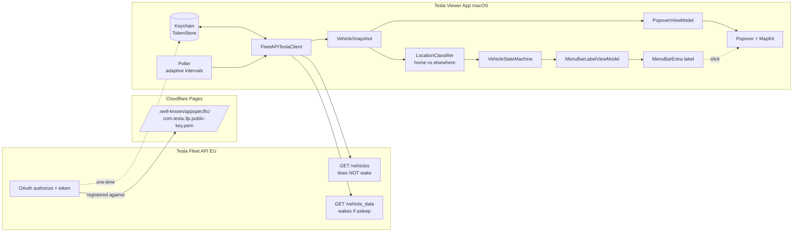
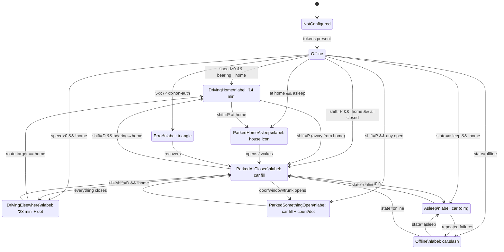

# Plan: Tesla Menubar App (macOS)

## Context

Greenfield hobby-project (repo `tesla-viewer`, branch `claude/plan-tesla-menubar-app-b9SlU`,
alleen een README aanwezig). Doel: een macOS menubar-app die op één Mac, voor één
gebruiker (EU, recent Tesla Model 3/Y/S/X), laat zien wat de auto doet — primair
de ETA tot huis of een andere bestemming, en bij stilstand of er deuren/ramen/
kofferbak/frunk openstaan. Klik op het menubar-item opent een popover met
MapKit-kaart, route, batterij en sync-info.

Randvoorwaarden uit het overleg:
- Mag niets kosten (dus geen Tessie/TeslaFi).
- Persoonlijk gebruik, geen notarization nodig, OAuth-callback mag localhost/custom-scheme zijn.
- Auto mag niet onnodig gewekt worden door polling.

## Bevestigde keuzes

| Beslissing | Keuze |
|---|---|
| Data-bron | **Tesla Fleet API** (EU host, OAuth, partner-app registratie). |
| Bestemmings-detectie | Primair `drive_state.active_route_*`; fallback heading+afstand t.o.v. home. |
| "Thuis gearriveerd" | `drive_state.shift_state == "P"` binnen home-radius (geen tijd-/afstand-heuristiek). |
| Polling | Adaptief; **altijd eerst `vehicles` (geen wake) en alleen `vehicle_data` als state=online**. |
| Tech stack | **SwiftUI `MenuBarExtra(.window)`**, macOS 14+, `MKMapView`/SwiftUI `Map` voor popover. |
| Secrets | Keychain (`kSecAttrAccessibleAfterFirstUnlock`), OAuth via `ASWebAuthenticationSession`. |
| Architectuur | MVVM, single target, `TeslaClient` protocol + Mock voor previews/tests. |
| Public-key hosting | **Cloudflare Pages** (free tier, werkt met private repos). |
| "Open" telt | Deuren + ramen + trunk + frunk. Charge port = aparte subtiele indicator bij laden. |
| ETA > 1 h format | `74 min` (geen `1 h 14`). |
| Thuis-geparkeerd + slapend | Klein huis-icoontje toegestaan in deze state. |
| Home-locatie | Knop "Use current location as home" in Settings, persisted in `UserDefaults`. |

## Architectuurdiagram



## State machine



Mapping naar UI:

| State | Menubar label | Popover hoofdinhoud |
|---|---|---|
| DrivingHome | `14 min` (plain text) | Map route → home; ETA / km / SOC / SOC@arrival |
| DrivingElsewhere | `23 min` + 2 px dot | Map route → dest; dest-naam; idem |
| ParkedAllClosed | `car.fill` | Map pin; SOC; "Geparkeerd sinds …" |
| ParkedSomethingOpen | `car.fill` + telling of oranje dot | Map + lijst open onderdelen (SF Symbols) |
| ParkedHomeAsleep | `house.fill` (klein) | Map pin op home + SOC + "Slapend" |
| Asleep | `car` (dimmed) | "Slapend"; laatste snapshot; refresh |
| Offline | `car.slash` | "Offline"; laatste snapshot |
| Error | `exclamationmark.triangle` | Foutmelding + retry |
| NotConfigured | `gear` | OAuth-knop |

## Polling-tabel

| State | Interval (op netstroom) | Interval (op batterij) | Endpoints |
|---|---|---|---|
| Driving | 15 s | 30 s | `vehicles` → `vehicle_data` |
| Online, parked | 60 s | 120 s | `vehicles` → `vehicle_data` |
| Asleep | 5 min | 10 min | **alleen** `vehicles` |
| Offline | 5 min → backoff 15 min | idem | alleen `vehicles` |
| Display sleep / clamshell | gepauzeerd | gepauzeerd | — |
| Geen netwerk | gepauzeerd | gepauzeerd | — |

Observers: `NSWorkspace.willSleepNotification` / `didWakeNotification`,
`NWPathMonitor`, `ProcessInfo.processInfo.isLowPowerModeEnabled`.

## Project-structuur (te creëren in Fase 1)

```
TeslaViewer.xcodeproj
TeslaViewer/
  App/
    TeslaViewerApp.swift          # @main, MenuBarExtra
  Features/
    MenuBar/
      MenuBarLabelView.swift
      MenuBarLabelViewModel.swift
    Popover/
      PopoverView.swift
      PopoverViewModel.swift
      MapCardView.swift
      OpenItemsListView.swift
    Setup/
      OAuthSheet.swift
      SetupViewModel.swift
    Settings/
      SettingsView.swift           # set home, intervals override, reset OAuth
  Domain/
    Models/
      Vehicle.swift
      DriveState.swift
      ClimateState.swift
      VehicleSnapshot.swift
      MenuBarState.swift           # enum met associated values
    Services/
      TeslaClient.swift            # protocol
      FleetAPITeslaClient.swift    # live impl, EU base URL
      MockTeslaClient.swift        # scriptbare scenario's
      TokenStore.swift             # Keychain wrapper
      VehicleStateMachine.swift    # snapshot → MenuBarState
      Poller.swift                 # adaptive scheduling
      LocationClassifier.swift     # home vs elsewhere, bearing
      DirectionsService.swift      # MKDirections wrapper + cache
  Infra/
    Keychain.swift
    Logger.swift
    Defaults.swift                 # @AppStorage keys
  Resources/
    Assets.xcassets                # app-icon; menubar uses SF Symbols
TeslaViewerTests/
  VehicleStateMachineTests.swift
  LocationClassifierTests.swift
  PollerTests.swift
```

## Gefaseerde roadmap

### Fase 1 — Skeleton + mock (1–2 avonden)
- Xcode-project, macOS 14 deployment target, SwiftUI life-cycle, `MenuBarExtra(.window)`.
- Domain-modellen + `MenuBarState` enum (alle 9 cases incl. `ParkedHomeAsleep`).
- `TeslaClient` protocol + `MockTeslaClient` met scriptbare scenario's.
- `VehicleStateMachine.reduce(snapshot, home) -> MenuBarState` + unit tests.
- `MenuBarLabelView` rendert elke state correct; debug-picker om handmatig te switchen.
- Snapshot-previews per state.

**Klaar wanneer**: alle 9 menubar-states pixel-perfect renderen vanuit `MockTeslaClient`.

### Fase 2 — Echte Tesla-integratie (2–3 avonden)
- Tesla partner-app registreren via developer.tesla.com (EU region).
- Cloudflare Pages site (private GitHub repo of direct upload) host
  `https://<sub>.<domein>/.well-known/appspecific/com.tesla.3p.public-key.pem`.
  Register dit domein als allowed origin in de partner-app.
- `Keychain.swift` + `TokenStore` (refresh + access + expiry).
- `OAuthSheet` met `ASWebAuthenticationSession`, custom scheme `teslaviewer://oauth/callback`.
- `FleetAPITeslaClient`: `GET /vehicles`, `GET /vehicles/{id}/vehicle_data`, token-refresh-on-401, retry/backoff.
- `Poller`: adaptieve intervals tabel hierboven; `NWPathMonitor` + sleep/wake observers.
- `LocationClassifier`: home-coördinaat in `Defaults`; bearing-naar-home; "Set current location as home"-knop in `SettingsView`.

**Klaar wanneer**: menubar toont live-data in alle reële states zonder dat de auto onverwacht wakker wordt.

### Fase 3 — Popover met MapKit (1–2 avonden)
- `PopoverView` (300×360 ongeveer): header met state-label, kaart, footer met sync + refresh.
- `MapCardView`: SwiftUI `Map` (macOS 14 API) met auto-annotation + dest-annotation + `MapPolyline`.
- `DirectionsService` met `MKDirections`, 60 s cache, fallback: rechte lijn als request faalt.
- ETA / afstand / SOC / SOC@arrival uit `active_route_*` velden, anders berekend.
- Parked-variant: `OpenItemsListView` met SF Symbols per open onderdeel.

**Klaar wanneer**: popover toont kaart + route bij rijden en open-onderdelen-lijst bij stilstand.

### Fase 4 — Polish (1 avond)
- `withAnimation` op state-transities, `contentTransition(.numericText())` voor ETA.
- Dark-mode review (system colors al; map style afstemmen).
- "Open at Login" via `SMAppService.mainApp.register()`.
- `SettingsView`: home-locatie, manuele intervals override, "Reset OAuth", versie-info.
- App-icoon + bevestigen dat menubar-symbols `template`-mode gebruiken (mee-kleuren met systeem).

## Te raken / aan te maken bestanden (overzicht)

Alles nieuw — geen bestaande code om aan te passen. Kritisch:
- `TeslaViewer/App/TeslaViewerApp.swift` — entry point + `MenuBarExtra`.
- `TeslaViewer/Domain/Services/FleetAPITeslaClient.swift` — alle Fleet API specifics geconcentreerd.
- `TeslaViewer/Domain/Services/VehicleStateMachine.swift` — single source of truth voor label-keuze.
- `TeslaViewer/Domain/Services/Poller.swift` — wake-safety logica.
- `TeslaViewer/Features/Setup/OAuthSheet.swift` — `ASWebAuthenticationSession` flow.
- `cloudflare/public/.well-known/appspecific/com.tesla.3p.public-key.pem` — public key host (apart deploy-artifact).

## Verificatie

**Per fase, lokaal te draaien op één Mac:**

1. **Fase 1**: `xcodebuild -scheme TeslaViewer test` → unit tests voor `VehicleStateMachine` en `LocationClassifier` slagen. Run app; debug-picker → elke menubar-state visueel checken.
2. **Fase 2**:
   - OAuth: app starten zonder tokens → sheet opent → na Tesla-login token in Keychain (`security find-generic-password -s nl.<jou>.teslaviewer`).
   - Wake-safety: zet auto handmatig in slaapstand (15 min ongebruikt), monitor met `log stream --predicate 'subsystem == "nl.<jou>.teslaviewer"'` dat alleen `vehicles`-calls gaan en `state=asleep` wordt gerespecteerd.
   - Live: rijd korte rit; observeer transitie offline → online → driving → parked.
3. **Fase 3**: tijdens rit popover openen, kaart toont auto + bestemmings-pin + route polyline; ETA in header komt overeen met menubar-label.
4. **Fase 4**: log uit, log opnieuw in, sluit MacBook (clamshell) → log laat zien dat polling pauzeert; open MacBook → polling hervat binnen 2 s.

## Open vragen (nog steeds te beantwoorden vóór Fase 2)

- **Cloudflare Pages domein**: heb je al een (sub)domein dat we mogen gebruiken (bv. `tesla.<jouwdomein>.nl`), of registreren we een nieuwe goedkope via Cloudflare? Vereist voor Tesla partner-app registratie.
- **Tesla developer account**: heb je al een account op developer.tesla.com / een toegekende partner-app? Zo nee, eerste aanvraag kan dagen duren — vroeg starten.

Geen blockers voor Fase 1; die kan starten zodra dit plan akkoord is.
